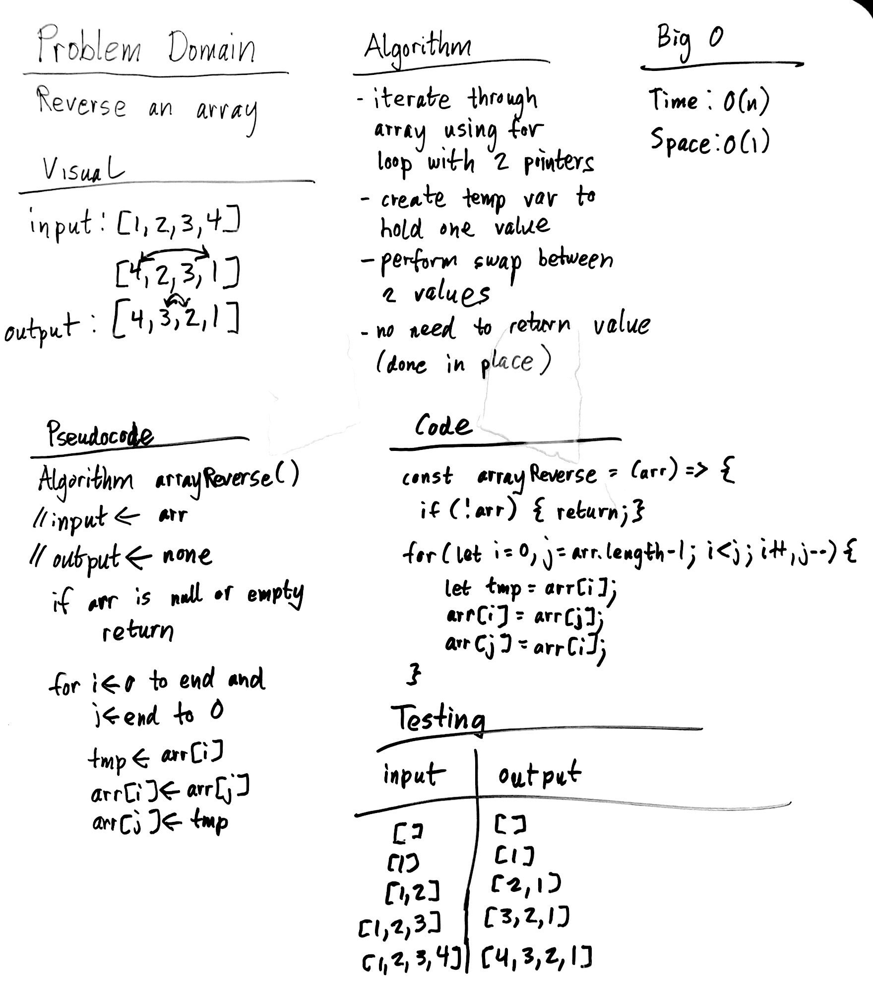

# Binary Search
Reverse an array!

## Challenge
Write a function called BinarySearch which takes in 2 parameters: a sorted array and the search key. Without utilizing any of the built-in methods available to your language, return the index of the array’s element that is equal to the search key, or -1 if the element does not exist.

## Approach & Efficiency
### Algorithm
- Iterate through the array with 2 pointers, each starting out on the sides and meeting in the middle.
- During the iteration, reverse 2 values at a time, creating a temp variable to hold one value while substituting it with the other value
- Return original array for easier testing (can actually be void as operations are being performed in place)

### Big O:
- Time: O(N)
- Space: O(1)

## Solution
