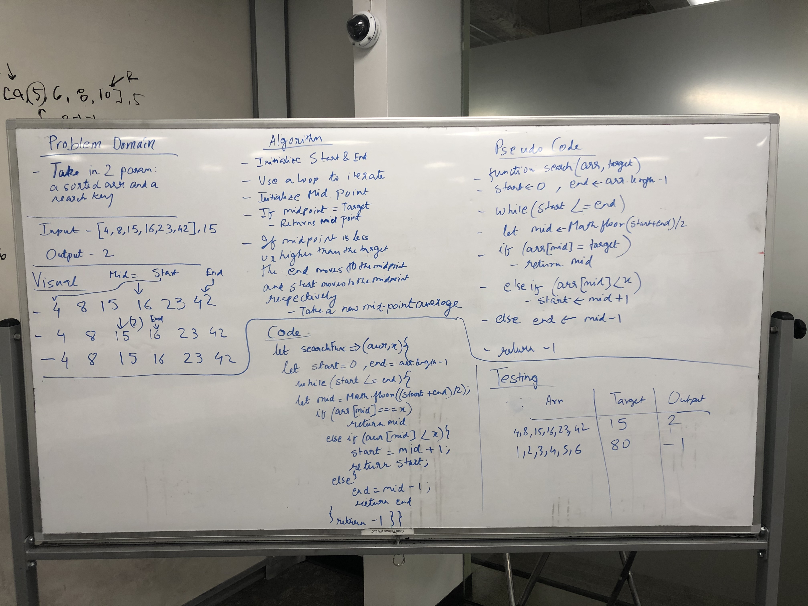

# Binary Search
Find index of target in array!

## Challenge
Write a function called BinarySearch which takes in 2 parameters: a sorted array and the search key. Without utilizing any of the built-in methods available to your language, return the index of the array’s element that is equal to the search key, or -1 if the element does not exist.

## Approach & Efficiency
### Algorithm
- establish high and low pointers as boundaries for where to check
- compare mid of high and low to target value
- move mid point accordingly depending on whether target is higher or lower
- repeat last two steps until target is found (mid returned) or low and high values are equal
- return -1 if target not found

### Big O:
- Time: O(log n)
- Space: O(1)

## Solution
