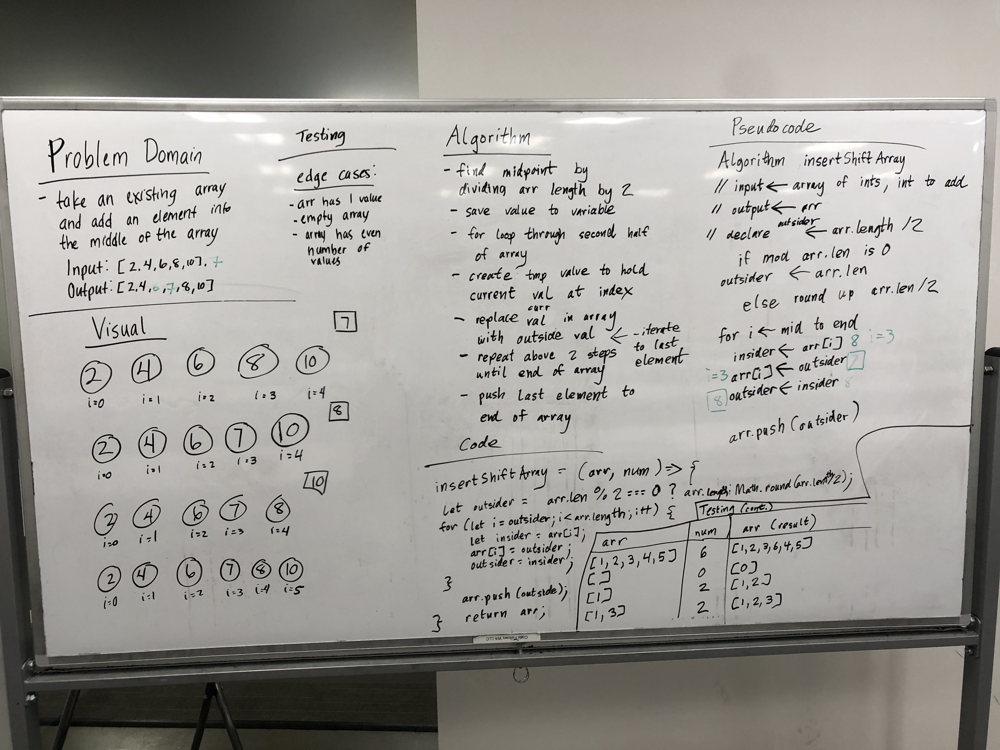

# Reverse an Array
Reverse an array!

## Challenge
Write a function called reverseArray which takes an array as an argument. Without utilizing any of the built-in methods available to your language, return an array with elements in reversed order.

## Approach & Efficiency
<!-- What approach did you take? Why? What is the Big O space/time for this approach? -->
### Algorithm
- Iterate through the array with 2 pointers, each starting out on the sides and meeting in the middle.
- During the iteration, reverse 2 values at a time, creating a temp variable to hold one value while substituting it with the other value;
- Return original array for easier testing (can actually be void as operations are being performed in place)

### Big O:
Time: O(N)
Space: O(1)

## Solution

