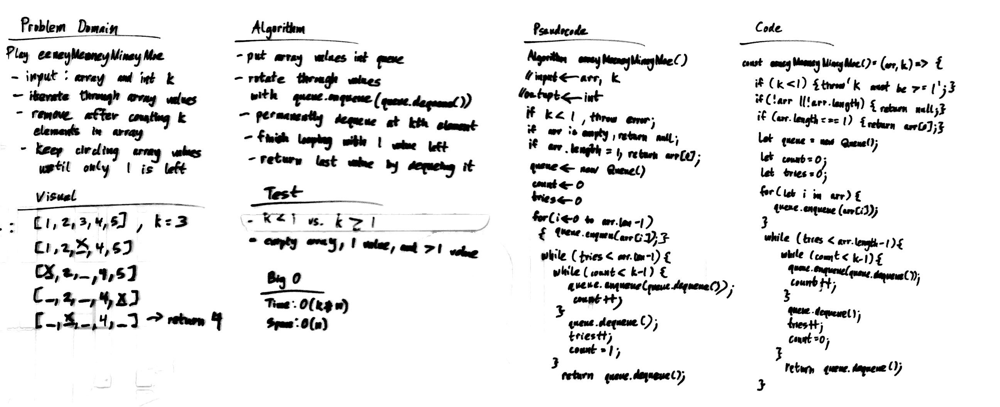

# Eeney Meeney Miney Moe

Catch a tiger by his toe!

## Challenge

People are standing in a circle playing Eeney Meeney Miney Moe. Counting begins at a specified point in the circle and proceeds around the circle in a specified direction. After a specified number of people are skipped, the next person is removed. The procedure is repeated with the remaining people, starting with the next person, going in the same direction and skipping the same number of people, until only one person remains, and wins the game.

Write a function called EeneyMeeneyMineyMoe() that accepts a list of strings and an int k. Start at the beginning of the list and count up to k and remove the person at that index from the list. Keep counting from that index and count up to k over and over until only one person is left in the list. Return a string with the name of the last person left in the list.

```
n=3
[A, B, C, D, E]    // 1A, 2B, 3C
[A, B, _, D, E]    // C was removed
[_, B, _, D, E]    // A was removed
[_, B, _, D, _]    // E was removed
[_, _, _, D, _]    // B was removed
                   // only D is left
```

## Approach & Efficiency

### Algorithm

1. create a queue with the array values so that values can be iterated in a circular fashion
2. iterate k steps and permanently remove item on kth step
3. finish loop when there is 1 element left
4. return last element by dequeuing it

### Big O:

- Time: O(k*n)
- Space: O(n)

## Solution


