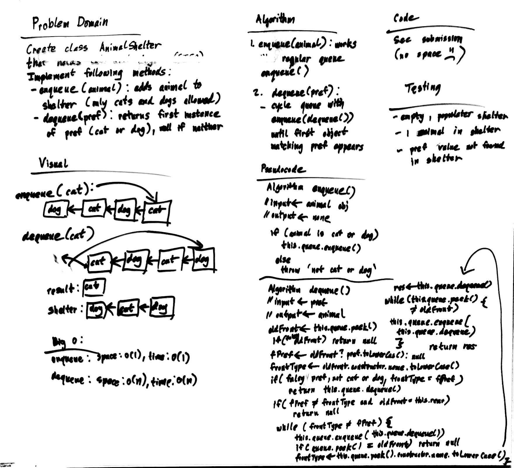

# FIFO Animal Shelter

First-in, First out Animal Shelter.

## Challenge

Create a class called AnimalShelter which holds only dogs and cats. The shelter operates using a first-in, first-out approach.
Implement the following methods:
- enqueue(animal): adds animal to the shelter. animal can be either a dog or a cat object.
- dequeue(pref): returns either a dog or a cat. If pref is not "dog" or "cat" then return null.

## Approach & Efficiency

### Algorithm

1. enqueue is the same as regular queue enqueue
2. dequeue: cycle through the queue looking for the first object with the same type as the preference (do enqueue(dequeue()) to cycle)
- account for edge cases: no pref, pref does not exist in shelter, empty shelter, 1 animal in shelter vs. multiple animals

### Big O:

- Time: O(N)
- Space: O(1)

## Solution

