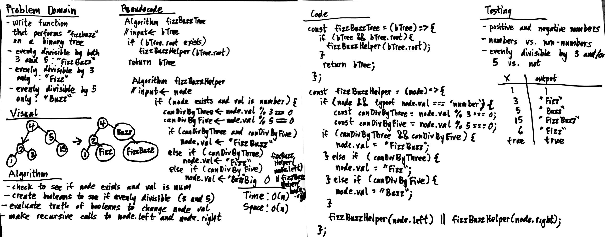

# Fizzbuzz Tree

Conduct “FizzBuzz” on a tree while traversing through it. Change the values of each of the nodes dependent on the current node’s value

## Challenge

1. Write a function called FizzBuzzTree which takes a tree as an argument.
2. Without utilizing any of the built-in methods available to your language, determine whether or not the value of each node is divisible by 3, 5 or both. Create a new tree with the same structure as the original, but the values modified as follows:
- If the value is divisible by 3, replace the value with “Fizz”
- If the value is divisible by 5, replace the value with “Buzz”
- If the value is divisible by 3 and 5, replace the value with “FizzBuzz”
- If the value is not divisible by 3 or 5, simply turn the number into a String.
3. Return the new tree.

## Approach & Efficiency

### Algorithm

1. create main function to take in the entire binary tree
2. call recursive helper function to take in the root node
2. within helper, check to see if node value is a number
2. figure out whether value is evenly divisible by both 3 and 5, just 3, or just 5
3. amend value accordingly
4. make a recursive call to the node's left child and then right child if left child is null
5. return tree at the end of the main function after helper function is done traversing

### Big O:

- Time: O(N)
- Space: O(N)

## Solution

