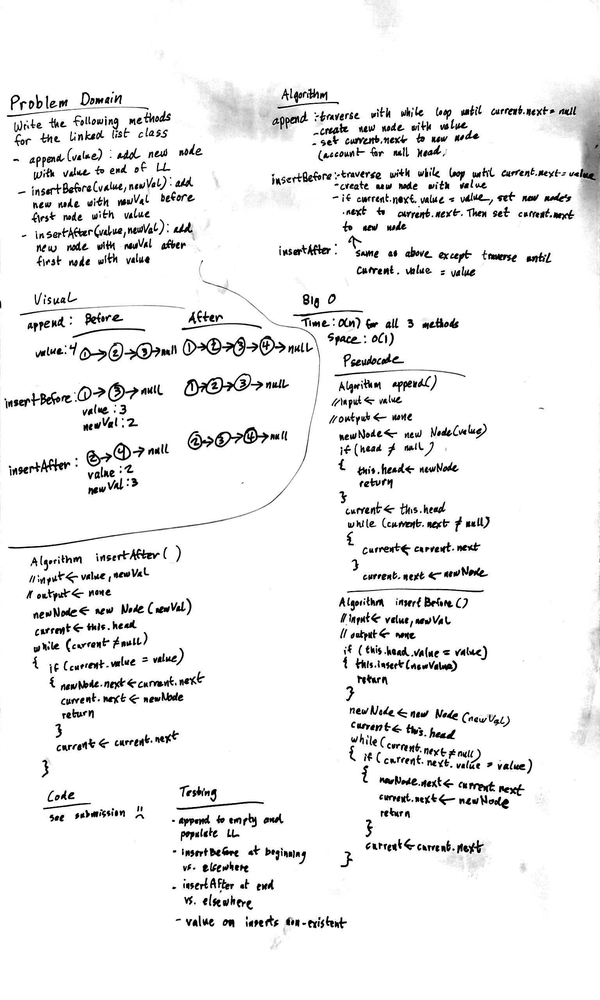

# Linked List Insertions
Implementing 3 insertion LL methods!

## Challenge
Write the following methods for the Linked List class:
- **.append(value)** which adds a new node with the given value to the end of the list
- **.insertBefore(value, newVal)** which add a new node with the given newValue immediately before the first value node
- **.insertAfter(value, newVal)** which add a new node with the given newValue immediately after the first value node

## Approach & Efficiency
### Algorithm
- create a current variable holding a reference to head when traversal is required
- traverse through linked list with a while loop
- re-assign references to head, current, and .next as needed

### Big O:
####
- Time: O(N)
- Space: O(1)

## Solution

