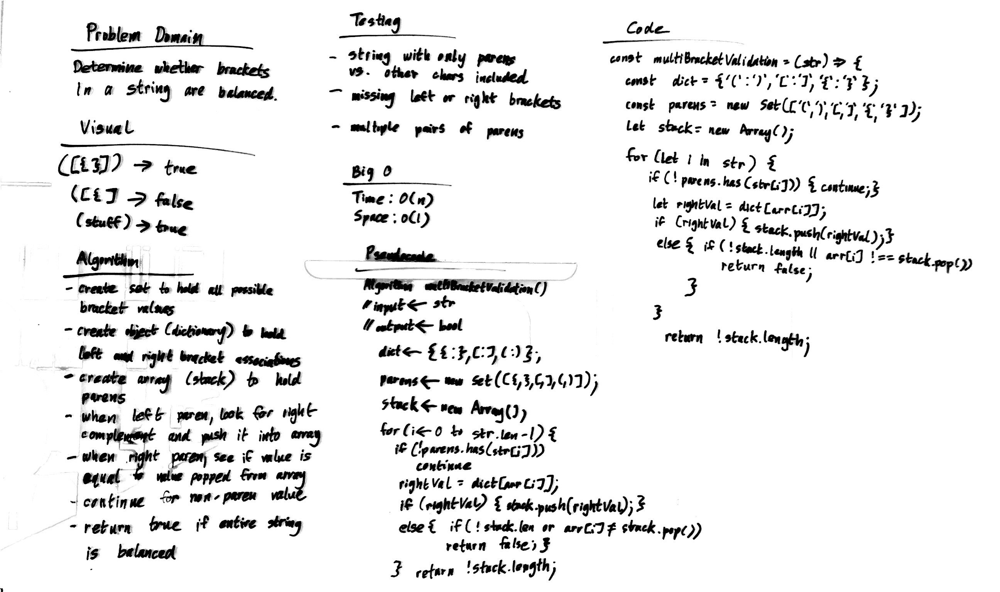

# Multi-bracket Validation.

Multi-bracket Validation.

## Challenge

Your function should take a string as its only argument, and should return a boolean representing whether or not the brackets in the string are balanced. There are 3 types of brackets:

```
Round Brackets : ()
Square Brackets : []
Curly Brackets : {}
```

## Approach & Efficiency

### Algorithm

- create a dictionary/object that contains left and right parentheses as key value pairs
- create new array
- create set to identify different kinds of parens
- iterate through string with for loop
- if char is not a paren, continue
- if current char is left paren, push its equivalent right paren
- else look at whether array is empty or char is equival to item popped off array -> return false
- return true if stack is empty at end, else return false

### Big O:

- Time: O(N)
- Space: O(1)

## Solution


