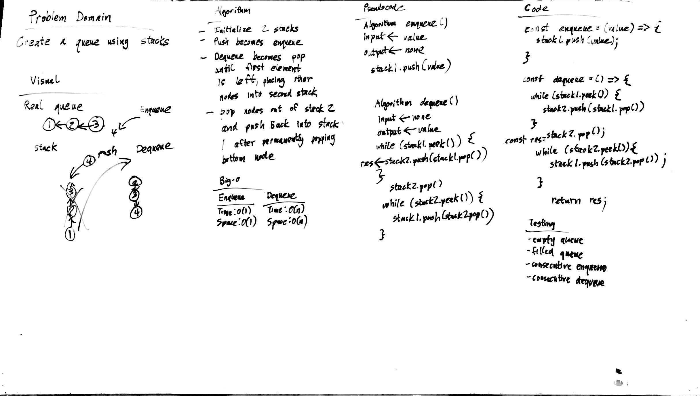

# Queue with Two Stacks

Implement a Queue using two Stacks.

## Challenge

Create a brand new PseudoQueue class. Do not use an existing Queue. Instead, this PseudoQueue class will implement our standard queue interface (the two methods listed below), but will internally only utilize 2 Stack objects. Ensure that you create your class with the following methods:
- enqueue(value) which inserts value into the PseudoQueue, using a first-in, first-out approach.
- dequeue() which extracts a value from the PseudoQueue, using a first-in, first-out approach.
The Stack instances have only push, pop, and peek methods. You should use your own Stack implementation. Instantiate these Stack objects in your PseudoQueue constructor.

## Approach & Efficiency

### Algorithm
- initialize 2 stacks
- push becomes enqueue
- deuqueue becomes pop until first element is left, placing other nodes into second stack
- pop nodes out of stack 2 and push back into stack 1 after permanently popping bottom node

### Big O:

#### Enqueue()
- Time: O(1)
- Space: O(1)

#### Dequeue()
- Time: O(N)
- Space: O(N)

## Solution

