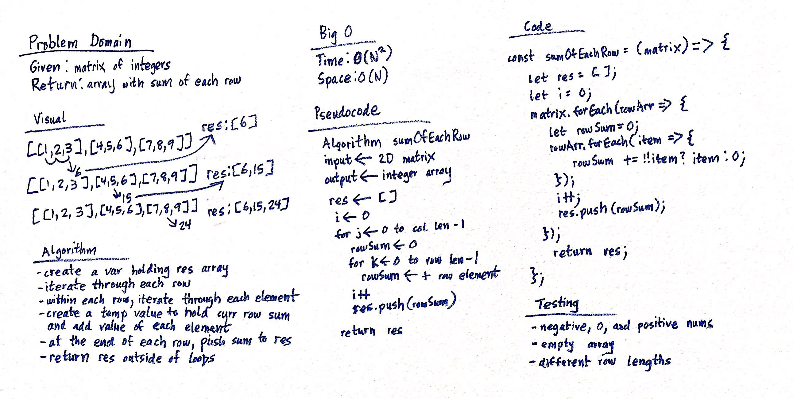

# Sum Of Each Row
Get sum of each matrix row!

## Challenge
Write a function to add up the sum of each row in a matrix of arbitrary size, and return an array with the appropriate values.

## Approach & Efficiency
### Algorithm
- create a var holding the res array
- iterate through each row
- within each row, iterate through each element
- create a temp value to hold curr row sum and add value of each element
- at the end of each row, push sum to res
- return res outside of nested for loops

### Big O:
- Time: O(N^2)
- Space: O(N)

## Solution

