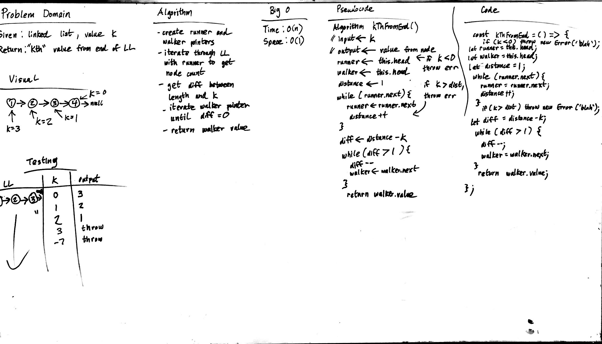

# k-th value from the end of a linked list
playing with runners

## Challenge
Write a method for the Linked List class which takes a number, k, as a parameter. Return the node’s value that is k from the end of the linked list. You have access to the Node class and all the properties on the Linked List class as well as the methods created in previous challenges.

## Approach & Efficiency
### Algorithm
- current runner and walker pointers
- iterate through linked list with runner to get node count
- get difference etween length and k
- iterate walker pointer under difference is 1 (because the last node is 0 from the end)
- return walker value

### Big O:
####
- Time: O(N)
- Space: O(1)

## Solution

